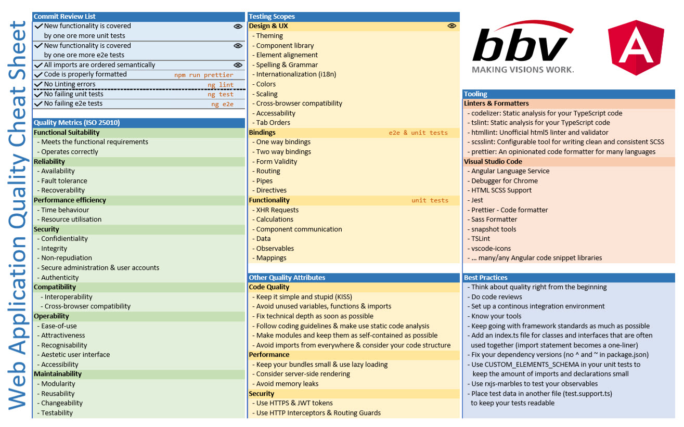

### bbv Gathering Berlin 2018

## Software Quality in modern Web applications

Patrick Ineichen

---

### About me

- Senior Software Engineer @ bbv since 2013
- .NET / Angular / Domain Driven Design
- Web Community Lead
- Current Project: Swisscom Health (curabill)

+++

### About me

Musician (Brass Band Feldmusik Buttisholz)

&size=auto 80%

+++

### About me

Musician (Pilatusgeister Luzern)

&size=auto 90%

+++

### About me

Musician (suurstOff)

&size=auto 80%

+++

### About me

Photographer (Gampel Open Air)

&size=auto 80%

---

### Schedule

- Round of introductions
- Workshop (Web Quality)
- My 50cents on Web Quality
- Sample Application presentation
- Code Walkthrough & Introduciton to rxjs-marbles
- Practical Exercises
- Introduction to Jest
- (Introduction to cypress)
- Practical Exercises
- Questions, Call to Action, Retro

--

### Round of introductions

- Who are you?
- What's your experience?
- Why are you here?
- What are your expectations

---

### Workshop (Web Quality)

- Find quality attributes around web applications
- Define quality assurance means

(Group work / Present your outcommings / Time: 20 Minutes)

---

### Web Application Quality Cheat Sheet

---

### Jest

- Testing is hard...
    - never have time, instead have deadlines
    - takes a lot of time
    - deal with setup
    - deal with data
    - whole new code to maintain

+++

### Jest

- Jest changes the way you think about testing
- Built around `JsDom` (like a headless browser)
    - Pure JavaScript implementation
    - Super fast

+++

### Why use Jest?

- Super fast (runs failed tests first)
- Snapshot testing
- Sandboxed (no side effects between tests)
- Error reporting (nice output, no stacktrace)
- Zero Config

+++

### Why use Jest?

Looks almost like Jasmine tests, in fact you can run your jasmine tests with jest.

Difference: Spys

+++

### Why use Jest?

Code coverage comes out of the box:

`jest --coverage`

### Snapshot testing

- Compares expectation to stored snapshot
- Stores a snapshot if it doesn't exist
- Pretty no maintenance needed
- Performs a diff on snapshot (what I expect vs. what I have)
- ... helps figuring out changes very quickly (just a mistake or has smtng changed?)
- easily update snapshots on refactor (e.g. watch mode)
- snapshots are gonna be checked in with Git