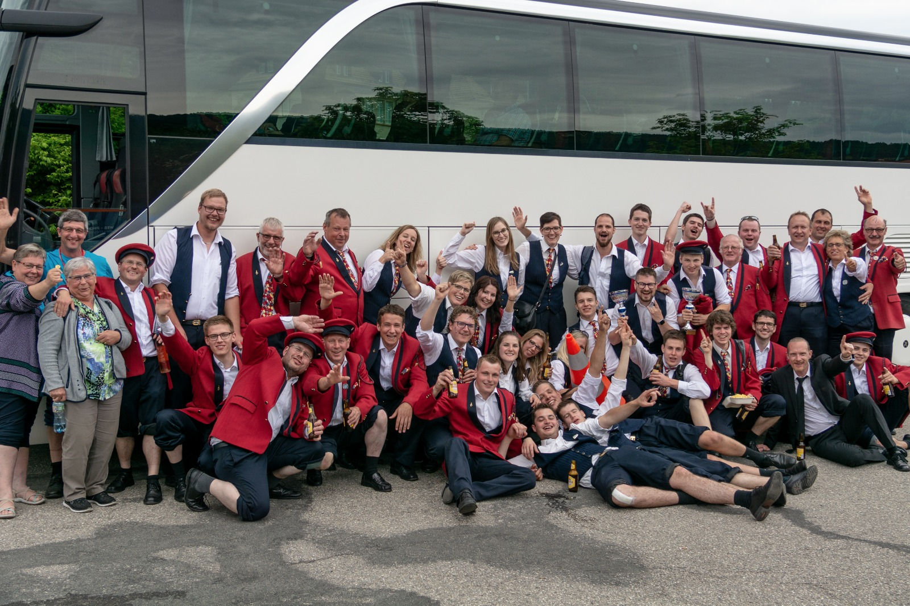
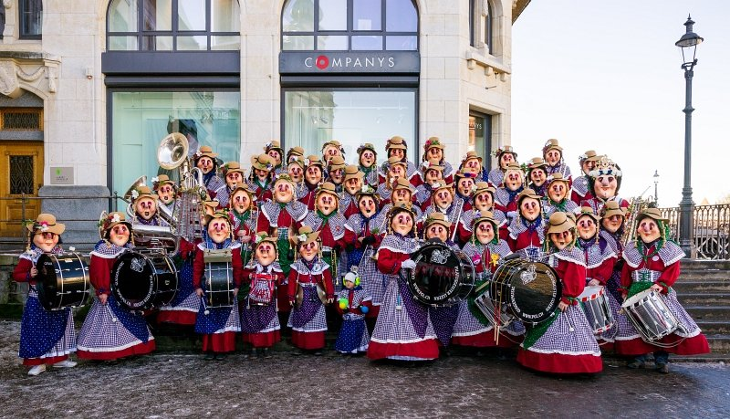
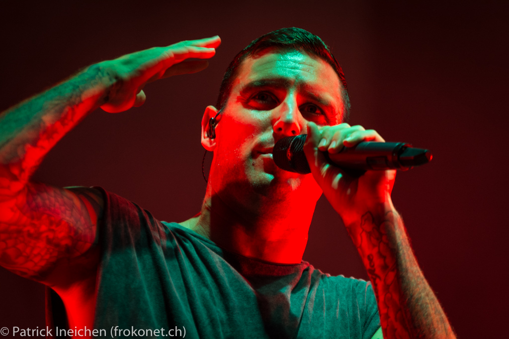

### bbv Gathering Berlin 2018

## Software Quality in modern Web applications

Patrick Ineichen

---

### About me

- Senior Software Engineer @ bbv since 2013
- .NET / Angular / Domain Driven Design
- Web Community Lead
- Current Project: Swisscom Health (curabill)

+++

### About me

Musician (Brass Band Feldmusik Buttisholz)

&size=auto 80%

+++

### About me

Musician (Pilatusgeister Luzern)

&size=auto 90%

+++

### About me

Musician (suurstOff)

&size=auto 80%

+++

### About me

Photographer (Gampel Open Air)

&size=auto 80%

---

### Schedule

- Round of introductions
- Workshop (Web Quality)
- My 50cents on Web Quality
- Sample Application presentation
- Code Walkthrough & Introduciton to rxjs-marbles
- Practical Exercises
- Introduction to Jest
- (Introduction to cypress)
- Practical Exercises
- Questions, Call to Action, Retro

--

### Round of introductions

- Who are you?
- What's your experience?
- Why are you here?
- What are your expectations

---

### Workshop (Web Quality)

- Find quality attributes around web applications
- Define quality assurance means

(Group work / Present your outcommings / Time: 20 Minutes)

---

### Web Application Quality Cheat Sheet

